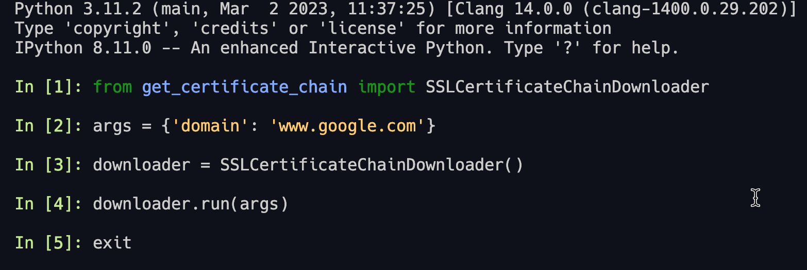
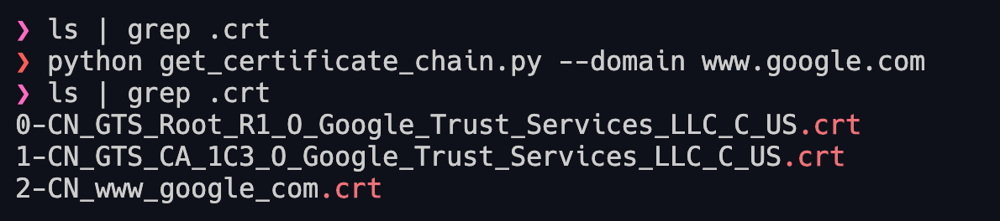

# Get Certificate Chain 🌐🔐

This Python script retrieves the certificate chain from a website, allowing you to analyze and verify the SSL/TLS certificates of the website. This project is a custom fork of the [getCertificateChain project](https://github.com/TheScriptGuy/getCertificateChain), and the overwhelming majority of credit goes to [TheScriptGuy](https://github.com/TheScriptGuy).

## Table of Contents

- [Get Certificate Chain 🌐🔐](#get-certificate-chain-)
  - [Table of Contents](#table-of-contents)
  - [Requirements 📋](#requirements-)
  - [Installation](#installation)
    - [PyPi](#pypi)
    - [GitHub](#github)
  - [Usage 🚀](#usage-)
    - [Import into script](#import-into-script)
    - [Command Line CLI](#command-line-cli)
      - [Arguments](#arguments)
  - [Contributing](#contributing)
  - [License](#license)

## Requirements 📋

- Python 3.10+
- Poetry (optional) - [Python Poetry](https://python-poetry.org/docs/)

## Installation

### PyPi

To install the package from PyPi, simply run the appropriate command.

```bash
pip install get-certificate-chain
```

### GitHub

To install from the GitHub repository, follow these steps:

1. Clone the repository.
2. Change the directory to the cloned repository.
3. Install the package using pip.

```bash
git clone https://github.com/cdot65/get_certificate_chain.git
cd get_certificate_chain
pip install .
```

## Usage 🚀

### Import into script

To use the package in your script, simply import the package and create an instance of the `SSLCertificateChainDownloader` object.

To pass arguments into the object, you can use the `argparse` library:

1. Import the argparse library.
2. Import the SSLCertificateChainDownloader object from the package.
3. Create an argument parser with a description.
4. Add your arguments.
5. Parse the arguments.
6. Create an instance of the SSLCertificateChainDownloader object.
7. Run the downloader object with the parsed arguments.

```python
from get_certificate_chain import SSLCertificateChainDownloader

downloader = SSLCertificateChainDownloader()
# Use the downloader object for your needs
```

To pass arguments into the object, you can use the `argparse` library:

```python
import argparse
from get_certificate_chain import SSLCertificateChainDownloader

# Add your arguments
args = parser.parse_args()

downloader = SSLCertificateChainDownloader()
downloader.run(args)
```

Or pass the arguments directly into the object:

```python
from get_certificate_chain import SSLCertificateChainDownloader
args = {'domain': 'www.google.com'}
downloader = SSLCertificateChainDownloader()
downloader.run(args)
```



### Command Line CLI

To use the script from the command line, run the following command:

```bash
python get_certificate_chain.py --domain www.google.com
```



#### Arguments

- `--domain`: The domain:port pair that the script should connect to. Defaults to www.google.com:443.
- `--rm-ca-files`: Remove the certificate files in the current working directory (*.crt, *.pem).
- `--get-ca-cert-pem`: Get cacert.pem from the curl.se website to help find Root CA.

## Contributing

Contributions are welcome! To contribute, please follow these guidelines:

1. Write tests for your code using `pytest`. Make sure your tests follow the standards set by the existing tests.
2. Set up a virtual environment using `Poetry`. You can install Poetry by following the instructions at https://python-poetry.org/docs/#installation.

To set up a new virtual environment for the project, run the appropriate command.

```bash
poetry install
```

To activate the virtual environment, run the appropriate command.

```bash
poetry shell
```

After making your changes and adding tests, ensure that all tests pass by running the appropriate command.

```bash
pytest
```

## License

This project is licensed under the MIT License - see the [LICENSE](LICENSE) file for details.
